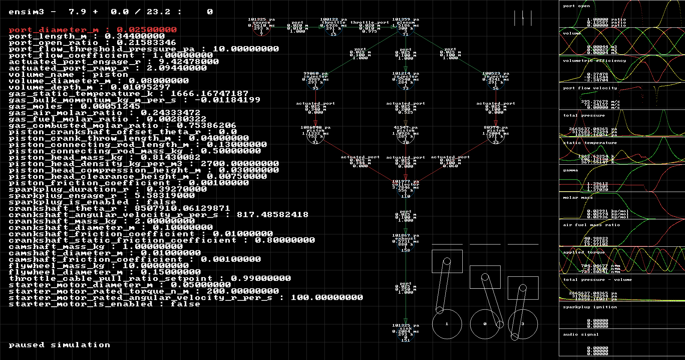

## ensim3

The internal combustion simulator with real time audio synthesis.



### Build

```
your-build-system --install sdl2 # eg. pacman -S sdl2
cd src
make
./ensim3
```

### Use

Press key `h` for a general help screen (and attributions).

### Source

Modules are emulated with headers and included in main.cc. Postfix `_n` defines
namespaces. Postfix `_t` defines structs. Members are public (C style) and accessed
directly without setters or getters. A single grid contains unique owners to nodes.
Nodes are volumes, connect to form a graph, and execute breadth first from a parent node,
using isentropic flow equations found commonplace in thermofluidic university level textbooks.

### Why the GPLv3 and not something more permissive?

This project encourage knowledge sharing, primarily in bridging gaps
mechanical engineering, control engineering, and software engineering.

If you are a game developer, or a mechanical engineer, looking to commercialize
real time procedural engine audio or an engine simulation, send me a email at
`airglouw at gmail dot com` and we can figure something out, otherwise try submitting a pull request.
